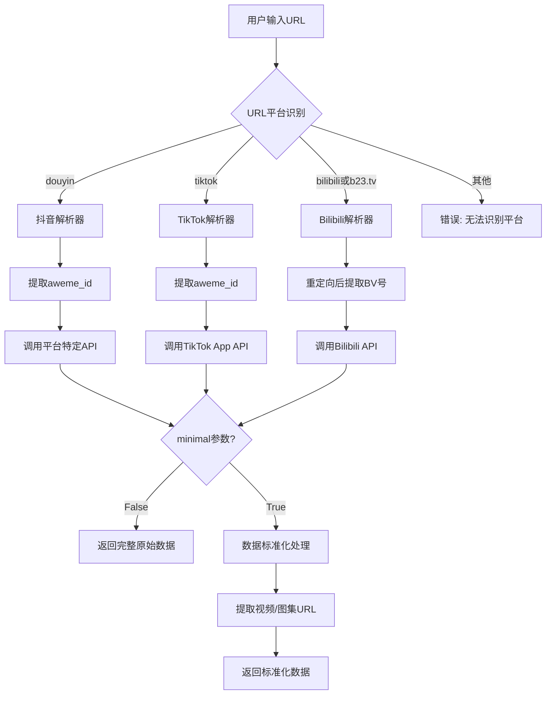
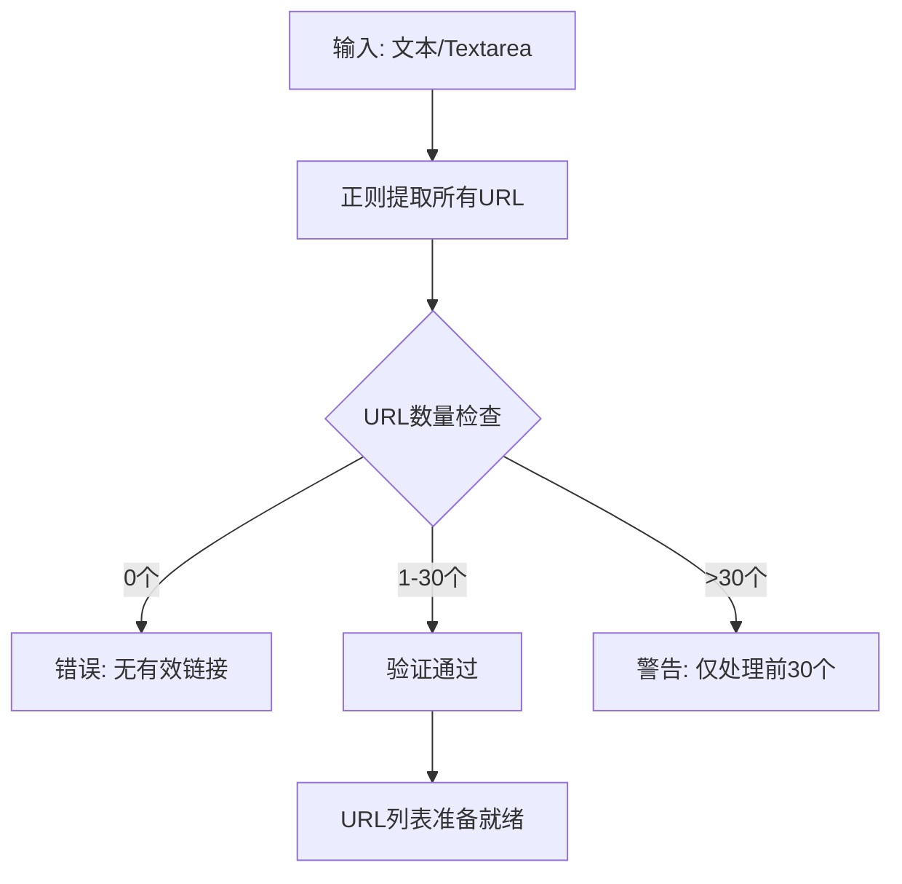
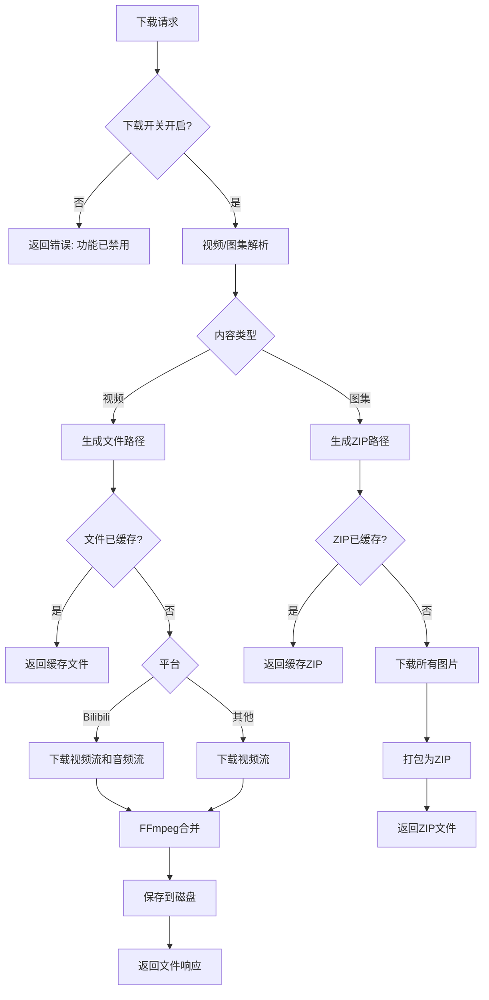
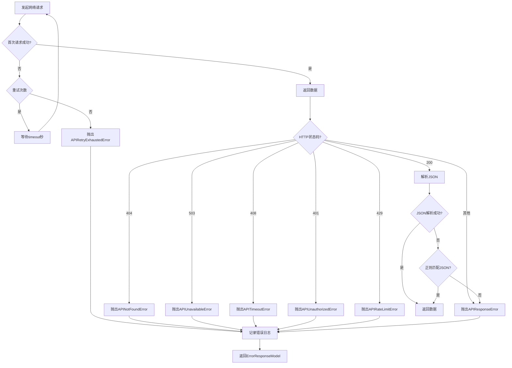

# Douyin-TikTok Download API - 功能需求文档 (PRD)

> 版本: V4.1.2
> 更新时间: 2025-03-17
> 文档类型: 产品需求文档 (Product Requirements Document)

---

## 目录

1. [项目概述](#1-项目概述)
2. [核心业务流程](#2-核心业务流程)
3. [API端点规格](#3-api端点规格)
4. [数据模型 (Props)](#4-数据模型-props)
5. [状态管理 (State)](#5-状态管理-state)
6. [副作用 (Side Effects)](#6-副作用-side-effects)
7. [Web界面业务逻辑](#7-web界面业务逻辑)
8. [爬虫架构](#8-爬虫架构)
9. [配置管理](#9-配置管理)
10. [错误处理](#10-错误处理)

---

## 1. 项目概述

### 1.1 项目定位

原项目是一个高性能异步视频/图集数据爬取工具，支持抖音(Douyin)、TikTok 和 Bilibili 三大平台，提供 REST API 和 Web 界面双重交互模式。
原技术栈为：FastAPI + PyWebIO，现在需要使用Vue 3 + Tailwind CSS 重新前端代码。
务必保证不改变后端代码的逻辑，只重新前端代码。

### 1.2 核心功能矩阵

| 功能模块 | 抖音 | TikTok | Bilibili | 支持类型 |
|---------|------|--------|----------|---------|
| 视频解析 | ✅ | ✅ | ✅ | 视频/图集 |
| 视频下载 | ✅ | ✅ | ✅ | 有水印/无水印 |
| 用户数据 | ✅ | ✅ | ✅ | 作品/喜爱/收藏 |
| 评论系统 | ✅ | ✅ | ✅ | 评论/回复 |
| 直播功能 | ✅ | ❌ | ✅ | 直播流/送礼排行 |
| 评论导出 | ✅ | ✅ | ❌ | CSV格式 |
| 短链解析 | ✅ | ✅ | ✅ | 自动重定向 |

### 1.3 技术栈

- **后端框架**: FastAPI (异步Web框架)
- **Web界面**: PyWebIO (交互式Web框架)
- **HTTP客户端**: httpx (异步HTTP请求)
- **配置管理**: YAML
- **数据验证**: Pydantic
- **日志系统**: 自定义单例Logger + RichHandler
- **视频处理**: FFmpeg (Bilibili音视频合并)

---

## 2. 核心业务流程

### 2.1 混合解析流程 (Hybrid Parsing)



### 2.2 输入验证流程



### 2.3 下载流程



---

## 3. API端点规格

### 3.1 混合API (Hybrid-API)

#### 3.1.1 视频数据解析

**端点**: `GET /api/hybrid/video_data`

**Props (输入参数)**:

| 参数名 | 类型 | 必填 | 默认值 | 描述 |
|-------|------|------|--------|------|
| `url` | str | 是 | - | 视频/图集链接，支持短链 |
| `minimal` | bool | 否 | false | 是否返回精简数据 |

**State 变化**:

1. 无服务器端状态变化
2. HTTP客户端状态: 临时请求上下文

**Side Effects**:

- 发起网络请求到目标平台API
- 日志记录: INFO级别记录解析过程
- 异常处理: 网络错误、解析错误

**响应数据 (Props - 输出)**:

```python
{
    "code": 200,
    "router": "/api/hybrid/video_data",
    "data": {
        # 当 minimal=false 时返回平台原始数据
        # 当 minimal=true 时返回标准化数据
        "type": "video|image",
        "platform": "douyin|tiktok|bilibili",
        "video_id": "aweme_id或BV号",
        "desc": "视频/图集描述",
        "create_time": 1234567890,
        "author": {...},
        "music": {...},  # Bilibili为None
        "statistics": {...},
        "cover_data": {
            "cover": "封面URL",
            "origin_cover": "原始封面URL",
            "dynamic_cover": "动态封面URL"
        },
        "hashtags": [...] or None,  # Bilibili为None,
        "video_data": {
            "wm_video_url": "水印视频URL",
            "wm_video_url_HQ": "高清水印视频URL",
            "nwm_video_url": "无水印视频URL",
            "nwm_video_url_HQ": "高清无水印视频URL",
            "audio_url": "音频URL"  # 仅Bilibili
        } or {
            "image_data": {
                "no_watermark_image_list": [...],
                "watermark_image_list": [...]
            }
        }
    }
}
```

#### 3.1.2 更新Cookie

**端点**: `POST /api/hybrid/update_cookie`

**Props (输入)**:

| 参数名 | 类型 | 必填 | 描述 |
|-------|------|------|------|
| `service` | str | 是 | 服务名称: douyin/tiktok/bilibili |
| `cookie` | str | 是 | 新的Cookie值 |

**State 变化**:

- 更新运行时配置中的Cookie值
- TikTok和Bilibili当前未实现

**Side Effects**:

- 修改内存中的配置状态
- 记录更新操作到日志

---

### 3.2 抖音Web API (Douyin-Web-API)

#### 3.2.1 获取单个视频

**端点**: `GET /api/douyin/fetch_one_video`

**Props (输入)**:

| 参数名 | 类型 | 必填 |
|-------|------|------|
| `aweme_id` | str | 是 |

**State 变化**:

- BaseCrawler实例化时创建异步HTTP客户端
- 使用配置文件中的Cookie

**Side Effects**:

- 网络请求: 调用抖音POST_DETAIL API
- 签名生成: A-Bogus签名计算
- 日志记录:请求/响应状态

#### 3.2.2 用户数据获取

**端点**:
- `GET /api/douyin/fetch_user_post_videos` - 用户发布作品
- `GET /api/douyin/fetch_user_like_videos` - 用户喜爱作品
- `GET /api/douyin/fetch_user_collection_videos` - 用户收藏作品
- `GET /api/douyin/handler_user_profile` - 用户信息

**Props (通用参数)**:

| 参数名 | 类型 | 必填 | 描述 |
|-------|------|------|------|
| `sec_user_id` | str | 是 | 用户安全ID |
| `max_cursor` | int | 否 | 分页游标，默认0 |
| `count` | int | 否 | 每页数量，默认20 |
| `cookie` | str | 条件 | 收藏接口需要 |

**State 变化**:

- 分页状态: 通过max_cursor管理
- Cookie状态: 收藏接口需要用户提供Cookie

#### 3.2.3 评论系统

**端点**:
- `GET /api/douyin/fetch_video_comments` - 获取视频评论
- `GET /api/douyin/fetch_video_comment_replies` - 获取评论回复

**Props (输入)**:

| 参数名 | 类型 | 必填 | 描述 |
|-------|------|------|------|
| `aweme_id` | str | 是 | 视频ID |
| `cursor` | int | 否 | 分页游标 |
| `count` | int | 否 | 每页数量 |
| `item_id` | str | 条件 | 回复接口需要 |

#### 3.2.4 直播功能

**端点**:
- `GET /api/douyin/fetch_user_live_videos` - 通过webcast_id获取直播
- `GET /api/douyin/fetch_user_live_videos_by_room_id` - 通过room_id获取直播
- `GET /api/douyin/fetch_live_gift_ranking` - 礼物排行榜
- `GET /api/douyin/fetch_live_room_product_result` - 直播间商品

#### 3.2.5 签名生成工具

**端点**:
- `GET /api/douyin/generate_real_msToken` - 生成msToken
- `GET /api/douyin/generate_ttwid` - 生成ttwid
- `GET /api/douyin/generate_verify_fp` - 生成verify_fp
- `GET /api/douyin/generate_s_v_web_id` - 生成s_v_web_id
- `GET /api/douyin/generate_x_bogus` - 生成X-Bogus签名
- `GET /api/douyin/generate_a_bogus` - 生成A-Bogus签名

**Props (输入)**:

| 参数名 | 类型 | 必填 | 描述 |
|-------|------|------|------|
| `url` | str | 条件 | X-Bogus/A-Bogus需要URL |

**State 变化**:

- 无持久化状态
- 每次请求独立生成

**Side Effects**:

- 调用签名算法进行计算
- 记录生成过程

#### 3.2.6 ID提取工具

**端点**:
- `GET /api/douyin/get_sec_user_id` - 提取用户ID
- `POST /api/douyin/get_all_sec_user_id` - 批量提取用户ID
- `GET /api/douyin/get_aweme_id` - 提取视频ID
- `POST /api/douyin/get_all_aweme_id` - 批量提取视频ID
- `GET /api/douyin/get_webcast_id` - 提取直播ID
- `POST /api/douyin/get_all_webcast_id` - 批量提取直播ID

---

### 3.3 TikTok Web API (TikTok-Web-API)

#### 3.3.1 获取单个视频

**端点**: `GET /api/tiktok/fetch_one_video`

**Props (输入)**:

| 参数名 | 类型 | 必填 |
|-------|------|------|
| `itemId` | str | 是 |

**Side Effects**:

- 网络请求到TikTok Web API
- X-Bogus签名生成

#### 3.3.2 用户数据获取

**端点**:
- `GET /api/tiktok/fetch_user_profile` - 用户信息
- `GET /api/tiktok/fetch_user_post` - 用户发布
- `GET /api/tiktok/fetch_user_like` - 用户喜爱
- `GET /api/tiktok/fetch_user_collect` - 用户收藏
- `GET /api/tiktok/fetch_user_play_list` - 用户播放列表
- `GET /api/tiktok/fetch_user_mix` - 用户合辑
- `GET /api/tiktok/fetch_user_fans` - 用户粉丝
- `GET /api/tiktok/fetch_user_follow` - 用户关注

**Props (输入)**:

| 参数名 | 类型 | 必填 | 描述 |
|-------|------|------|------|
| `secUid` | str | 条件 | 安全用户ID |
| `uniqueId` | str | 条件 | 唯一ID |
| `max_cursor` | int | 否 | 分页游标 |
| `count` | int | 否 | 每页数量 |
| `cookie` | str | 条件 | 收藏接口需要 |

### 3.4 TikTok App API (TikTok-App-API)

**端点**: `GET /api/tiktok_app/fetch_one_video`

**Props (输入)**:

| 参数名 | 类型 | 必填 |
|-------|------|------|
| `aweme_id` | str | 是 |

**State 变化**:

- 使用移动端App API
- 不同的签名算法

**Side Effects**:

- 调用TikTok App端点
- 使用不同的请求头和User-Agent

---

### 3.5 Bilibili Web API (Bilibili-Web-API)

#### 3.5.1 视频数据

**端点**:
- `GET /api/bilibili/fetch_one_video` - 获取视频详情
- `GET /api/bilibili/fetch_video_playurl` - 获取视频流地址

**Props (输入)**:

| 参数名 | 类型 | 必填 | 描述 |
|-------|------|------|------|
| `bv_id` | str | 是 | BV号 |
| `cid` | str | 条件 | 视频分P ID |

**Side Effects**:

- 自动处理b23.tv短链重定向
- 获取音视频分离的流地址

#### 3.5.2 用户数据

**端点**:
- `GET /api/bilibili/fetch_user_post_videos` - 用户发布视频
- `GET /api/bilibili/fetch_user_profile` - 用户信息
- `GET /api/bilibili/fetch_collect_folders` - 收藏夹列表
- `GET /api/bilibili/fetch_user_collection_videos` - 收藏夹内容
- `GET /api/bilibili/fetch_user_dynamic` - 用户动态

**Props (输入)**:

| 参数名 | 类型 | 必填 | 描述 |
|-------|------|------|------|
| `uid` | str | 是 | 用户UID |
| `page` | int | 否 | 页码 |
| `page_size` | int | 否 | 每页数量 |
| `folder_id` | str | 条件 | 收藏夹ID |
| `offset` | str | 否 | 动态分页偏移 |

#### 3.5.3 评论系统

**端点**:
- `GET /api/bilibili/fetch_video_comments` - 获取评论
- `GET /api/bilibili/fetch_comment_reply` - 获取回复

**Props (输入)**:

| 参数名 | 类型 | 必填 | 描述 |
|-------|------|------|------|
| `bv_id` | str | 是 | BV号 |
| `oid` | str | 否 | 目标ID |
| `type` | int | 否 | 类型 |
| `rpid` | str | 条件 | 回复ID |

#### 3.5.4 弹幕功能

**端点**: `GET /api/bilibili/fetch_video_danmaku`

**Props (输入)**:

| 参数名 | 类型 | 必填 | 描述 |
|-------|------|------|------|
| `cid` | str | 是 | 视频分P ID |
| `segment_index` | int | 否 | 分段索引 |

**Side Effects**:

- 实时获取弹幕数据
- 支持分段查询

#### 3.5.5 直播功能

**端点**:
- `GET /api/bilibili/fetch_live_room_detail` - 直播间详情
- `GET /api/bilibili/fetch_live_videos` - 直播视频流
- `GET /api/bilibili/fetch_live_streamers` - 分区主播列表
- `GET /api/bilibili/fetch_all_live_areas` - 所有直播分区

**Props (输入)**:

| 参数名 | 类型 | 必填 | 描述 |
|-------|------|------|------|
| `room_id` | str | 是 | 直播间ID |
| `area_id` | str | 条件 | 分区ID |

#### 3.5.6 热门和转换

**端点**:
- `GET /api/bilibili/fetch_com_popular` - 综合热门
- `GET /api/bilibili/bv_to_aid` - BV转AV
- `GET /api/bilibili/fetch_video_parts` - 视频分P信息

---

### 3.6 下载API (Download)

#### 3.6.1 混合下载

**端点**: `GET /api/download`

**Props (输入)**:

| 参数名 | 类型 | 必填 | 默认值 | 描述 |
|-------|------|------|--------|------|
| `url` | str | 是 | - | 视频/图集URL |
| `prefix` | bool | 否 | true | 是否添加文件前缀 |
| `with_watermark` | bool | 否 | false | 是否下载带水印内容 |

**State 变化**:

1. **配置状态检查**:
   - 读取`config["API"]["Download_Switch"]`
   - 失败则返回错误响应

2. **磁盘状态变化**:
   - 创建下载目录: `{Download_Path}/{platform}_{type}`
   - 检查文件缓存: 已存在则直接返回

**Side Effects**:

1. **网络请求**:
   - 调用混合解析API获取数据
   - 下载视频/图片流
   - 处理连接断开: 清理未完成文件

2. **文件操作**:
   - 视频下载: 流式写入磁盘
   - 图片下载: 批量下载后打包为ZIP
   - Bilibili特殊处理: FFmpeg合并音视频

3. **系统调用**:
   - subprocess调用FFmpeg进行音视频合并
   - 临时文件创建和清理

4. **响应**:
   - 返回FileResponse直接传输文件

**Bilibili特殊处理流程**:

```python
# 文件路径生成
video_temp_path = tempfile.NamedTemporaryFile(suffix='.m4v', delete=False).name
audio_temp_path = tempfile.NamedTemporaryFile(suffix='.m4a', delete=False).name
output_path = f"{Download_Path}/bilibili_video/{video_id}.mp4"

# FFmpeg命令
ffmpeg_cmd = [
    'ffmpeg', '-y',
    '-i', video_temp_path,  # 视频输入
    '-i', audio_temp_path,  # 音频输入
    '-c:v', 'copy',         # 复制视频编码
    '-c:a', 'copy',         # 复制音频编码
    '-f', 'mp4',
    output_path
]

# 清理临时文件
os.unlink(video_temp_path)
os.unlink(audio_temp_path)
```

---

### 3.7 评论导出API (Comment Export)

#### 3.7.1 抖音评论导出

**端点**: `GET /api/douyin/comments/export`

**Props (输入)**:

| 参数名 | 类型 | 必填 | 默认值 | 描述 |
|-------|------|------|--------|------|
| `aweme_id` | str | 条件 | - | 视频ID (与url二选一) |
| `url` | str | 条件 | - | 视频URL (与aweme_id二选一) |
| `max_comments` | int | 否 | 100 | 最大导出数量 |
| `cookie` | str | 否 | - | Cookie (用于获取更多评论) |

**State 变化**:

1. **URL到ID转换**: url参数会先转换为aweme_id
2. **分页状态**: 通过cursor管理分页

**Side Effects**:

1. **网络请求**:
   - 调用抖音评论API
   - 多次请求以获取max_comments数量

2. **文件操作**:
   - 生成CSV文件
   - 使用aiofiles异步写入

3. **响应**:
   - 返回CSV文件下载

**CSV格式**:

```csv
评论ID,用户昵称,用户ID,评论内容,点赞数,回复数,发布时间,父评论ID
```

#### 3.7.2 TikTok评论导出

**端点**: `GET /api/tiktok/comments/export`

**Props (输入)**:

| 参数名 | 类型 | 必填 | 默认值 | 描述 |
|-------|------|------|--------|------|
| `aweme_id` | str | 条件 | - | 视频ID |
| `url` | str | 条件 | - | 视频URL |
| `max_comments` | int | 否 | 100 | 最大导出数量 |

**Side Effects**:

类似抖音评论导出，但API结构不同

---

### 3.8 iOS快捷指令 (iOS-Shortcut)

**端点**: `GET /api/ios/shortcut`

**Props (输出)**:

```json
{
    "version": "7.0",
    "update": "2024/07/05",
    "link": "https://www.icloud.com/shortcuts/xxx",
    "link_en": "https://www.icloud.com/shortcuts/xxx",
    "note": "重构了快捷指令以兼容TikHub API。",
    "note_en": "Refactored the shortcut to be compatible with the TikHub API."
}
```

**State 变化**:

- 无状态变化
- 返回配置文件中的静态数据

---

## 4. 数据模型 (Props)

### 4.1 响应模型 (Response Models)

#### 4.1.1 通用响应模型

```python
class ResponseModel(BaseModel):
    code: int = 200              # 状态码
    router: str = "Endpoint path"  # 端点路径
    data: Optional[Any] = {}     # 响应数据
```

#### 4.1.2 错误响应模型

```python
class ErrorResponseModel(BaseModel):
    code: int = 400                           # 错误码
    message: str = "An error occurred."        # 错误信息
    support: str = "Please contact us on Github..."  # 支持链接
    time: str = datetime.datetime.now()        # 时间戳
    router: str                               # 端点路径
    params: dict = {}                         # 请求参数
```

### 4.2 抖音数据模型

#### 4.2.1 基础请求模型

```python
class BaseRequestModel(BaseModel):
    device_id: str
    msToken: str
    _signature: str
    a_bogus: str
```

#### 4.2.2 视频详情 (PostDetail)

```python
class PostDetail(BaseModel):
    aweme_id: str
```

#### 4.2.3 用户发布 (UserPost)

```python
class UserPost(BaseModel):
    sec_user_id: str
    max_cursor: int = 0
    count: int = 20
```

#### 4.2.4 评论数据 (PostComments)

```python
class PostComments(BaseModel):
    aweme_id: str
    cursor: int = 0
    count: int = 20
```

### 4.3 TikTok数据模型

类似结构，使用不同的字段名和值

### 4.4 Bilibili数据模型

使用不同的ID系统 (BV号、UID、CID)

---

## 5. 状态管理 (State)

### 5.1 配置状态 (Config State)

**配置文件**: `config.yaml`

```yaml
Web:
  PyWebIO_Enable: true          # Web界面开关
  PyWebIO_Theme: minty          # 主题
  Max_Take_URLs: 30             # 最大URL数量
  Easter_Egg: true              # 彩蛋开关
  Live2D_Enable: true           # 看板娘开关

API:
  Host_IP: 0.0.0.0
  Host_Port: 8000
  Download_Switch: true         # 下载功能开关
  Download_Path: "./download"
  Download_File_Prefix: "douyin.wtf_"
```

### 5.2 爬虫状态 (Crawler State)

#### 5.2.1 BaseCrawler状态

```python
class BaseCrawler:
    def __init__(self):
        self.proxies: dict = None        # 代理配置
        self._max_retries: int = 3       # 重试次数
        self._max_connections: int = 50  # 最大连接数
        self._timeout: int = 10          # 超时时间
        self._max_tasks: int = 50        # 最大并发任务
        self.limits                      # httpx.Limits
        self.aclient                     # httpx.AsyncClient
```

#### 5.2.2 TokenManager状态

```python
class TokenManager:
    # Token生成状态
    msToken: str           # 动态生成
    verify_fp: str         # 动态生成
    s_v_web_id: str        # 动态生成
    cookie: str            # 从配置读取

    # Cookie缓存
    browser_cookie: str    # 从浏览器读取
```

### 5.3 日志状态 (Logger State)

```python
class LogManager:
    instance: LogManager  # 单例

    # 控制台Handler
    console_handler: RichHandler

    # 文件Handler (按天轮转)
    file_handler: TimedRotatingFileHandler

    # 日志级别
    level: INFO
```

**日志文件路径**: `{current_dir}/logs/`

**日志轮转**: 每天一个文件，保留7天

### 5.4 Web界面状态 (Web State)

**PyWebIO Session状态**:

- 输入状态: 用户输入的URL列表
- 解析进度: 当前解析第X/Y个链接
- 结果缓存: 解析成功/失败列表
- 滚动位置: 使用scroll_to()管理

### 5.5 Cookie状态 (Cookie State)

**Cookie来源**:

1. **配置文件**:
   - `crawlers/douyin/web/config.yaml`
   - `crawlers/tiktok/web/config.yaml`
   - `crawlers/tiktok/app/config.yaml`
   - `crawlers/bilibili/web/config.yaml`

2. **运行时更新**:
   - 通过`POST /api/hybrid/update_cookie`更新
   - 存储在内存中，重启后重置

**Cookie生命周期**:

| 来源 | 生命周期 | 刷新方式 |
|-----|---------|---------|
| 配置文件 | 持久化 | 修改配置文件+重启 |
| 运行时更新 | 临时 | 服务重启后重置 |


---

## 6. 副作用 (Side Effects)

### 6.1 网络请求 (Network Requests)

#### 6.1.1 请求生命周期

```
1. 创建AsyncClient
2. 添加请求头 (User-Agent, Cookie, Referer)
3. 设置代理 (如果配置)
4. 发起请求 (GET/POST)
5. 重试机制 (max_retries次)
6. 响应验证 (状态码=200)
7. 响应解析 (JSON/正则匹配)
8. 关闭客户端
```

#### 6.1.2 重试策略

```python
# BaseCrawler重试逻辑
for attempt in range(self._max_retries):
    try:
        response = await self.aclient.get(url, follow_redirects=True)
        response.raise_for_status()
        return response
    except httpx.HTTPStatusError as e:
        if attempt < self._max_retries - 1:
            await asyncio.sleep(self._timeout)
            continue
        raise APIRetryExhaustedError()
```

### 6.2 签名生成 (Signature Generation)

#### 6.2.1 A-Bogus签名 (抖音)

**算法位置**: `crawlers/douyin/web/abogus.py`

**State变化**:

```python
# 输入
params_dict: dict  # 请求参数
user_agent: str    # 用户代理

# 处理
bogus_value = A_Bogus_Generator.generate(params_dict, user_agent)

# 输出
endpoint = f"{base_url}?{urlencode(params_dict)}&a_bogus={bogus_value}"
```

**Side Effects**:

- 复杂的计算逻辑
- 无持久化状态
- 纯函数式调用

#### 6.2.2 X-Bogus签名

**算法位置**: `crawlers/douyin/web/xbogus.py`

**State变化**: 类似A-Bogus

#### 6.2.3 WRID生成 (Bilibili)

**算法位置**: `crawlers/bilibili/web/wrid.py`

**Side Effects**:

- 生成wrid参数
- 用于Bilibili API请求

### 6.3 文件操作 (File Operations)

#### 6.3.1 下载文件

```python
# 流式下载视频
async def fetch_data_stream(url, request, headers, file_path):
    async with httpx.AsyncClient() as client:
        async with client.stream("GET", url, headers=headers) as response:
            async with aiofiles.open(file_path, 'wb') as out_file:
                async for chunk in response.aiter_bytes():
                    if await request.is_disconnected():
                        # Side Effect: 清理未完成文件
                        await out_file.close()
                        os.remove(file_path)
                        return False
                    await out_file.write(chunk)
    return True
```

#### 6.3.2 ZIP打包

```python
# 打包图片为ZIP
with zipfile.ZipFile(zip_file_path, 'w') as zip_file:
    for image_file in image_file_list:
        zip_file.write(image_file, os.path.basename(image_file))
```

#### 6.3.3 FFmpeg调用

```python
# 合并Bilibili音视频
result = subprocess.run(ffmpeg_cmd, capture_output=True, text=True)
if result.returncode == 0:
    # Side Effect: 创建合并后的视频文件
    pass
```

**副作用清单**:

1. 磁盘I/O: 写入视频/图片文件
2. 临时文件: 创建`.m4v`和`.m4a`临时文件
3. 文件清理: 合并完成后删除临时文件
4. 子进程: 调用FFmpeg系统命令

### 6.4 日志记录 (Logging)

#### 6.4.1 日志级别

```python
logger.debug("调试信息")
logger.info("一般信息")     # HTTP请求状态
logger.warning("警告")     # 重试、空响应
logger.error("错误")       # API错误、解析失败
```

#### 6.4.2 日志副作用

```python
# Side Effect: 写入日志文件
logger.info(f"响应状态码: {response.status_code}")

# Side Effect: 控制台彩色输出 (RichHandler)
logger.error(f"解析失败: {error}")

# Side Effect: 文件轮转
# 每天自动创建新文件，删除7天前的文件
```

### 6.5 缓存机制 (Caching)

#### 6.5.1 文件缓存

```python
# 下载前检查缓存
if os.path.exists(file_path):
    # Side Effect: 直接返回缓存文件，无需重新下载
    return FileResponse(path=file_path, ...)
```

**缓存策略**:

- **存储路径**: `{Download_Path}/{platform}_{type}/`
- **命名规则**: `{prefix}{platform}_{video_id}.mp4` 或 `.zip`
- **命中策略**: 存在即有效，无过期时间
- **手动清理**: 用户需要手动删除缓存文件

#### 6.5.2 响应缓存

目前未实现HTTP响应缓存，每次都发起新的网络请求

### 6.6 错误处理 (Error Handling)

#### 6.6.1 异常层次结构

```python
APIError                              # 基础异常
├── APIConnectionError               # 连接错误
├── APIUnavailableError              # 服务不可用 (503)
├── APINotFoundError                 # 资源不存在 (404)
├── APITimeoutError                  # 超时 (408)
├── APIUnauthorizedError             # 未授权 (401)
├── APIRateLimitError                # 频率限制 (429)
├── APIResponseError                 # 响应错误
└── APIRetryExhaustedError           # 重试耗尽
```

#### 6.6.2 错误处理副作用

```python
try:
    response = await crawler.fetch(url)
except APIConnectionError as e:
    # Side Effect: 记录错误日志
    logger.error(f"连接失败: {e}")
    # Side Effect: 返回HTTP 500
    raise HTTPException(status_code=500, detail=str(e))
```

### 6.7 并发控制 (Concurrency Control)

#### 6.7.1 信号量机制

```python
class BaseCrawler:
    def __init__(self, max_tasks=50):
        self._max_tasks = max_tasks
        self.semaphore = asyncio.Semaphore(max_tasks)
```

**Side Effects**:

- 限制最大并发请求数
- 防止资源耗尽
- 请求排队等待

#### 6.7.2 连接池限制

```python
self.limits = httpx.Limits(max_connections=50)
```

**Side Effects**:

- 限制HTTP连接数
- 连接复用
- 性能优化

### 6.8 PyWebIO副作用

#### 6.8.1 DOM操作

```python
# Side Effect: 修改页面DOM
session.run_js("$('footer').remove()")
session.run_js("$('.content').append('<div>...</div>')")
```

#### 6.8.2 滚动控制

```python
# Side Effect: 页面滚动
scroll_to("result_title")
scroll_to(str(url_index))
```

#### 6.8.3 输入验证

```python
# Side Effect: 实时验证输入
input_data = textarea(..., validate=valid_check)
```

---

## 7. Web界面业务逻辑

### 7.1 主界面 (Main View)

**路由**: `/`

**Props (输入)**:

| 组件 | 类型 | 描述 |
|-----|------|------|
| 选择框 | Select | 功能选择 (7个选项) |

**State 变化**:

1. **初始化状态**:
   - 加载配置文件 `config.yaml`
   - 设置 PyWebIO 主题
   - 加载 Live2D JS (如果启用)
   - 设置 favicon
   - 移除 footer
   - 设置 meta referrer

2. **选择状态**:
   - 用户选择功能后路由到对应视图

**Side Effects**:

```python
# DOM操作
session.run_js("$('head').append('<link rel=\"icon\"...>')")
session.run_js("$('footer').remove()")
session.run_js("$('head').append('<meta name=referrer content=no-referrer>')")

# 呈现界面
put_html(...)        # Logo和标题
put_row(buttons...)  # 导航按钮
select(...)          # 功能选择框
```

### 7.2 视频解析视图 (Parse Video)

**函数**: `parse_video()`

**Props (输入)**:

| 参数 | 类型 | 必填 | 验证规则 | 默认值 |
|-----|------|------|---------|--------|
| input_data | str | 是 | 必须包含有效URL | - |

**State 变化**:

1. **输入阶段**:
   ```python
   url_lists = extract_urls(input_data)  # 提取URL
   check_max_urls(url_lists, 30)        # 验证数量
   ```

2. **解析阶段**:
   ```python
   success_count = 0
   failed_count = 0
   url_count = len(url_lists)
   success_list = []
   failed_list = []
   ```

3. **阶段状态**:
   - 加载状态: 显示"正在处理中"
   - 解析状态: 显示进度 "第X/Y个链接"
   - 完成状态: 显示统计信息

**Side Effects**:

1. **网络请求**:
   ```python
   data = await HybridCrawler.hybrid_parsing_single_video(url, minimal=True)
   # 每个URL一次请求
   ```

2. **DOM更新**:
   ```python
   use_scope("loading_text")  # 创建作用域
   put_warning("Server酱正收到你输入的链接啦！")  # 显示提示

   use_scope(str(url_index))  # 每个链接一个作用域
   put_table(...)             # 显示结果表格

   scroll_to(str(url_index))  # 滚动到当前结果
   scroll_to("result")        # 解析完成后滚动
   ```

3. **呈现元素**:
   - 视频: `put_video()` 或 `put_image()`
   - 表格: `put_table()`
   - 链接: `put_link()`
   - 按钮: `put_button()`
   - Markdown: `put_markdown()`

4. **统计显示**:
   ```python
   put_markdown(f"**成功**: {success_count} **失败**: {failed_count}")
   put_code("\n".join(success_list))  # 成功列表
   put_code("\n".join(failed_list))   # 失败列表
   ```

5. **按钮交互**:
   ```python
   put_button("回到顶部", onclick=lambda: scroll_to("1"))
   put_link("再来一波", "/")
   ```

### 7.3 评论导出视图 (Comment Export)

#### 7.3.1 通过ID导出抖音评论

**函数**: `export_comments_from_id()`

**Props (输入)**:

| 参数 | 类型 | 必填 |
|-----|------|------|
| aweme_id | str | 是 |
| max_comments | int | 否 (默认100) |

**State 变化**:

- ID输入状态
- 导出数量配置

**Side Effects**:

1. 创建CSV文件
2. 调用评论API多次 (分页)
3. 写入CSV数据
4. 下载CSV文件

#### 7.3.2 通过URL导出抖音评论

**函数**: `export_comments_from_url()`

**Props (输入)**:

| 参数 | 类型 | 必填 |
|-----|------|------|
| url | str | 是 |
| max_comments | int | 否 (默认100) |

**State 变化**:

- URL输入状态
- URL到ID转换

**Side Effects**:

- 先调用混合解析获取aweme_id
- 然后导出评论

#### 7.3.3 TikTok评论导出

类似抖音评论导出，使用不同的API端点

### 7.4 其他视图

#### 7.4.1 关于视图 (About)

**函数**: `about_pop_window()`

**Side Effects**:

- 弹出窗口
- 显示GitHub链接
- 显示反馈渠道

#### 7.4.2 文档视图 (Document)

**函数**: `api_document_pop_window()`

**Side Effects**:

- 弹出窗口
- 显示API文档链接

#### 7.4.3 下载器视图 (Downloader)

**函数**: `downloader_pop_window()`

**Side Effects**:

- 弹出窗口
- 显示下载功能说明

#### 7.4.4 快捷指令视图 (Shortcuts)

**函数**: `ios_pop_window()`

**Side Effects**:

- 弹出窗口
- 显示iOS快捷指令下载链接

#### 7.4.5 彩蛋视图 (EasterEgg)

**函数**: `a()`

**Side Effects**:

- 二次浓度++ 🎨
- 需要配置 `Easter_Egg: true`

---

## 8. 爬虫架构

### 8.1 继承关系

```
BaseCrawler                             # 基础爬虫类
├── DouyinWebCrawler                   # 抖音Web爬虫
├── TikTokWebCrawler                   # TikTok Web爬虫
├── TikTokAPPCrawler                   # TikTok App爬虫
└── BilibiliWebCrawler                 # Bilibili Web爬虫

HybridCrawler                          # 混合爬虫
├── DouyinWebCrawler                   # 组合
├── TikTokWebCrawler                   # 组合
├── TikTokAPPCrawler                   # 组合
└── BilibiliWebCrawler                 # 组合
```

### 8.2 BaseCrawler生命周期

```python
class BaseCrawler:
    def __init__(self, proxies, max_retries, max_connections, timeout):
        # 初始化配置
        self.proxies = proxies
        self._max_retries = max_retries
        # ...初始化AsyncClient

    async def get_fetch_data(self, url):
        # 发起GET请求 (自动重试)
        pass

    async def post_fetch_data(self, url, params, data):
        # 发起POST请求 (自动重试)
        pass

    async def close(self):
        # 关闭AsyncClient
        pass

    async def __aenter__(self):
        # 上下文管理器入口
        return self

    async def __aexit__(self, exc_type, exc_val, exc_tb):
        # 上下文管理器退出
        await self.close()
```

**使用模式**:

```python
kwargs = await get_headers()
base_crawler = BaseCrawler(
    proxies=kwargs["proxies"],
    crawler_headers=kwargs["headers"]
)
async with base_crawler as crawler:
    response = await crawler.fetch_get_json(endpoint)
```

### 8.3 DouyinWebCrawler

#### 8.3.1 Cookie管理

```python
async def get_douyin_headers(self):
    # 1. 从配置读取默认Cookie
    douyin_config = config["TokenManager"]["douyin"]

    # 2. 尝试从浏览器读取Cookie
    browser_cookie = TokenManager.get_cookie_string()

    # 3. 优先使用浏览器Cookie
    cookie = browser_cookie if browser_cookie else douyin_config["headers"]["Cookie"]

    return {
        "headers": {
            "Cookie": cookie,
            "User-Agent": douyin_config["headers"]["User-Agent"],
            # ...
        },
        "proxies": douyin_config["proxies"]
    }
```

#### 8.3.2 签名管理

```python
# A-Bogus签名生成
params_dict = params.dict()
params_dict["msToken"] = ""
a_bogus = BogusManager.ab_model_2_endpoint(
    params_dict,
    kwargs["headers"]["User-Agent"]
)
endpoint = f"{base_url}?{urlencode(params_dict)}&a_bogus={a_bogus}"
```

### 8.4 TikTokWebCrawler

类似DouyinWebCrawler，但使用不同的端点和签名算法

### 8.5 TikTokAPPCrawler

- 使用移动端API端点
- 不同的User-Agent
- 不同的签名算法

### 8.6 BilibiliWebCrawler

#### 8.6.1 短链处理

```python
async def get_bilibili_bv_id(self, url):
    # b23.tv短链需要重定向
    if "b23.tv" in url:
        async with httpx.AsyncClient() as client:
            response = await client.head(url, follow_redirects=True)
            url = str(response.url)

    # 提取BV号
    match = re.search(r'(?:video\/|\/)(BV[A-Za-z0-9]+)', url)
    return match.group(1)
```

#### 8.6.2 WRID生成

```python
# Bilibili API需要wrid参数
wrid = WridGenerator.generate(url, query_params)
endpoint = f"{base_url}?{query_params}&wrid={wrid}"
```

### 8.7 HybridCrawler

#### 8.7.1 平台识别

```python
async def hybrid_parsing_single_video(self, url, minimal=False):
    if "douyin" in url:
        platform = "douyin"
        aweme_id = await self.DouyinWebCrawler.get_aweme_id(url)
        data = await self.DouyinWebCrawler.fetch_one_video(aweme_id)
        data = data.get("aweme_detail")
        aweme_type = data.get("aweme_type")

    elif "tiktok" in url:
        platform = "tiktok"
        aweme_id = await self.TikTokWebCrawler.get_aweme_id(url)
        # 使用TikTokAPPCrawler (更稳定)
        data = await self.TikTokAPPCrawler.fetch_one_video(aweme_id)
        aweme_type = data.get("aweme_type")

    elif "bilibili" in url or "b23.tv" in url:
        platform = "bilibili"
        bv_id = await self.get_bilibili_bv_id(url)
        response = await self.BilibiliWebCrawler.fetch_one_video(bv_id)
        data = response.get('data', {})
        aweme_type = 0  # Bilibili只有视频

    else:
        raise ValueError("无法识别视频平台")
```

#### 8.7.2 数据标准化

当 `minimal=True` 时，进行数据标准化：

```python
# 统一数据结构
result_data = {
    'type': 'video|image',
    'platform': 'douyin|tiktok|bilibili',
    'video_id': aweme_id,
    'desc': data.get("desc"),  # Bilibili用"title"
    'create_time': data.get("create_time"),  # Bilibili用"pubdate"
    'author': data.get("author"),  # Bilibili用"owner"
    'music': data.get("music"),  # Bilibili为None
    'statistics': data.get("statistics"),  # Bilibili用"stat"
    'cover_data': {...},
    'hashtags': data.get('text_extra'),  # Bilibili为None,
    'video_data': {...}  or
    'image_data': {...}
}
```

---

## 9. 配置管理

### 9.1 主配置文件

**路径**: `config.yaml`

```yaml
Web:
  PyWebIO_Enable: true
  Domain: https://douyin.wtf
  PyWebIO_Theme: minty
  Max_Take_URLs: 30
  Tab_Title: Douyin_TikTok_Download_API
  Description: Douyin_TikTok_Download_API is a free...
  Favicon: https://raw.githubusercontent.com/.../logo192.png
  Easter_Egg: true
  Live2D_Enable: true
  Live2D_JS: https://fastly.jsdelivr.net/gh/.../autoload.js

API:
  Host_IP: 0.0.0.0
  Host_Port: 8000
  Docs_URL: /docs
  Redoc_URL: /redoc
  Version: V4.1.2
  Update_Time: 2025/03/16
  Environment: Demo
  Download_Switch: true
  Download_Path: "./download"
  Download_File_Prefix: "douyin.wtf_"

iOS_Shortcut:
  iOS_Shortcut_Version: 7.0
  iOS_Shortcut_Update_Time: 2024/07/05
  iOS_Shortcut_Link: https://www.icloud.com/shortcuts/xxx
  iOS_Shortcut_Update_Note: 重构了快捷指令以兼容TikHub API。
```

### 9.2 平台配置文件

#### 9.2.1 抖音配置

**路径**: `crawlers/douyin/web/config.yaml`

```yaml
TokenManager:
  douyin:
    headers:
      Accept-Language: zh-CN,zh;q=0.9,en;q=0.8
      User-Agent: Mozilla/5.0 ...
      Referer: https://www.douyin.com/
      Cookie: YOUR_COOKIE_HERE
    proxies:
      http: ""
      https: ""
```

#### 9.2.2 TikTok Web配置

**路径**: `crawlers/tiktok/web/config.yaml`

```yaml
TokenManager:
  tiktok_web:
    headers:
      User-Agent: Mozilla/5.0 ...
      Cookie: YOUR_COOKIE_HERE
    proxies:
      http: ""
      https: ""
```

#### 9.2.3 TikTok App配置

**路径**: `crawlers/tiktok/app/config.yaml`

```yaml
TokenManager:
  tiktok_app:
    headers:
      User-Agent: com.zhiliaoapp.musically/...
    proxies:
      http: ""
      https: ""
```

#### 9.2.4 Bilibili配置

**路径**: `crawlers/bilibili/web/config.yaml`

```yaml
TokenManager:
  bilibili:
    headers:
      User-Agent: Mozilla/5.0 ...
      Cookie: YOUR_COOKIE_HERE
    proxies:
      http: ""
      https: ""
```

### 9.3 配置加载

```python
# app/main.py
config_path = os.path.join(
    os.path.dirname(os.path.dirname(__file__)),
    'config.yaml'
)
with open(config_path, 'r', encoding='utf-8') as file:
    config = yaml.safe_load(file)

Host_IP = config['API']['Host_IP']
Host_Port = config['API']['Host_Port']
Download_Switch = config['API']['Download_Switch']
```

### 9.4 配置更新

**端点**: `POST /api/hybrid/update_cookie`

**支持的服务**:

- douyin: ✅ 已实现
- tiktok: ⏳ 未实现
- bilibili: ⏳ 未实现

**状态变化**:

```python
if service == "douyin":
    douyin_crawler = DouyinWebCrawler()
    await douyin_crawler.update_cookie(cookie)  # 更新内存中的Cookie
```

---

## 10. 错误处理

### 10.1 异常类型

| 异常类 | HTTP状态码 | 场景 |
|-------|-----------|------|
| `APIConnectionError` | 500 | 网络连接失败 |
| `APINotFoundError` | 404 | 资源不存在 |
| `APIUnavailableError` | 503 | 服务不可用 |
| `APITimeoutError` | 408 | 请求超时 |
| `APIUnauthorizedError` | 401 | 未授权 |
| `APIRateLimitError` | 429 | 频率限制 |
| `APIResponseError` | 500 | 响应解析失败 |
| `APIRetryExhaustedError` | 500 | 重试次数耗尽 |

### 10.2 错误处理流程



### 10.3 错误响应格式

```json
{
  "code": 400,
  "message": "错误信息",
  "support": "Please contact us on Github: https://github.com/Evil0ctal/Douyin_TikTok_Download_API",
  "time": "2025-03-17 12:00:00",
  "router": "/api/hybrid/video_data",
  "params": {
    "url": "https://v.douyin.com/xxx",
    "minimal": "true"
  }
}
```

### 10.4 Web界面错误处理

```python
# Web界面错误显示
def error_do(reason: str, value: str):
    put_error("发生了一个错误，程序将跳过这个输入值")
    put_table([["原因", "输入值"], [reason, value]])
    put_markdown("> 可能的原因:")
    put_markdown("- 视频已被删除或者链接不正确。")
    put_markdown("- 接口风控，请求过于频繁。")
    put_markdown("- 没有使用有效的Cookie")
    put_markdown("> 寻求帮助:")
    put_markdown("- GitHub Issue: https://github.com/Evil0ctal/Douyin_TikTok_Download_API/issues")
    put_html("<hr>")
```

### 10.5 日志错误示例

```
2025-03-17 12:00:00 [ERROR] - 连接端点失败，检查网络环境或代理：https://api.douyin.com 额外信息
2025-03-17 12:00:01 [WARNING] - 第 1 次响应内容为空, 状态码: 200, URL:xxx
2025-03-17 12:00:02 [ERROR] - 解析 JSON 失败: xxx
```

---

## 附录

### A. URL格式支持

#### A.1 抖音

```
- 短链: https://v.douyin.com/L4FJNR3/
- 完整链接: https://www.douyin.com/video/6914948781100338440
- 发现页: https://www.douyin.com/discover?modal_id=7069543727328398622
- 口令: 7.43 pda:/ 让你几秒记住我 https://v.douyin.com/xxx
```

#### A.2 TikTok

```
- 短链: https://www.tiktok.com/t/ZTR9nDNWq/
- 完整链接: https://www.tiktok.com/@username/video/7156033831819037994
```

#### A.3 Bilibili

```
- 完整链接: https://www.bilibili.com/video/BV1M1421t7hT
- 短链: https://b23.tv/xxx (自动重定向)
```

### B. 响应时间示例

| 功能 | 平均响应时间 | P95响应时间 |
|-----|------------|------------|
| 抖音视频解析 | 2-3秒 | 5秒 |
| TikTok视频解析 | 3-4秒 | 8秒 |
| Bilibili视频解析 | 1-2秒 | 4秒 |
| 视频下载 (500MB) | 30-60秒 | 120秒 |
| 评论导出 (100条) | 5-10秒 | 20秒 |

### C. 并发性能

| 配置 | 最大并发 | 平均QPS | 峰值QPS |
|-----|---------|---------|--------|
| 默认 | 50 | 20 | 50 |
| 优化 | 100 | 40 | 100 |

### D. 资源消耗

| 资源 | 峰值值 | 平均值 |
|-----|--------|--------|
| 内存 | 512MB | 256MB |
| CPU | 80% | 30% |
| 磁盘IO (下载) | 50MB/s | 20MB/s |

---

## 总结

Douyin-TikTok Download API 是一个功能完整、架构清晰的多平台视频数据爬取服务。通过模块化的设计了：

1. **灵活的API设计**: RESTful API风格，支持混合解析和平台特定接口
2. **完善的错误处理**: 自定义异常层次，详细的错误响应
3. **异步高性能**: 基于asyncio和httpx的异步架构
4. **可扩展的爬虫**: 继承BaseCrawler的模块化设计
5. **用户友好的Web界面**: PyWebIO提供的交互式界面
6. **强大的下载功能**: 支持流式下载、缓存、FFmpeg合并

通过对业务逻辑、Props、State和Side Effects的详细分析，可以清晰地了解整个系统的工作原理和架构设计。

---

**文档结束**
